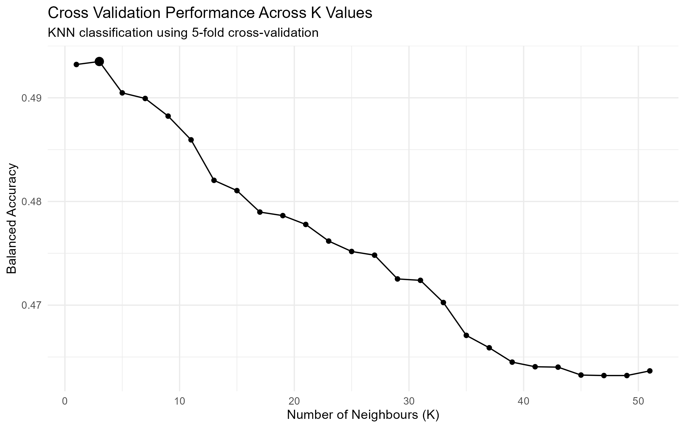

```{r}
#| label: load-packages
library(tidyverse)
library(tidymodels)
library(patchwork)
```

```{r}
#| label: load-data

# load processed analysis data
analysis_valid <- read_csv(
  "data/processed/analysis_valid.csv",
  show_col_types = FALSE)
```

The table below summarizes the most important variables used throughout the data-building and analysis workflow.

```{r}
#| label: variable-reference
#| echo: false
#| output: true
variable_reference <- tibble(
  `Air Quality` = c(
    "Station_Date",
    "Year",
    "Month",
    "NAPS_ID",
    "Station_Name",
    "Latitude",
    "Longitude",
    "mean_pm25",
    "max_pm25",
    "hours_observed",
    "valid_day",
    "Month_Name",
    "pm25_level" # classification
  ),

  Fire = c(
    "Fire_ID",
    "Fire_Year",
    "Report_Date",
    "Fire_Date",
    "Fire_Latitude",
    "Fire_Longitude",
    "Size_Ha",
    "Cause",
    "Response",
    "",
    "",
    "",
    ""
  ),

  Relationship = c(
    "days_since_fire",
    "Distance_km",
    "fire_count_100km_{7/14/30}d",
    "fire_count_250km_{7/14/30}d",
    "fire_area_250km_{7/14/30}d",
    "nearest_fire_km_{7/14/30}d",
    # EDA
    "recent_fire_250km_14d",    # TRUE/FALSE
    "fire_activity_250km_14d",  # 0-6+ four fire classes
    "fire_distance_group ",      # four distance classes
    "",
    "",
    "",
    ""
  )
)

knitr::kable(
  variable_reference,
  caption = "Key variables used throughout the analysis",
  na = ""
)
```


---

## Question

*Can recent large-fire activity and proximity be used to classify whether a station day observes a very high PM2.5?*

For this analysis, unusually **high PM2.5** is defined as a daily mean PM2.5 concentration at or above the 90th percentile of valid station-days. (Data-derived threshold and not an environmental health standard)


## Define
```{r}
#| label: define-high-pm25
# define high pm25
high_pm25_cutoff <- quantile(analysis_valid$mean_pm25, 0.90)
high_pm25_cutoff
```

```{r}
#| label: create-factor

# create factor
classification_data <- analysis_valid |>
  mutate(
    pm25_level = if_else(
      mean_pm25 >= high_pm25_cutoff,
      "High",
      "Normal"
    ),
    
    pm25_level = factor(
      pm25_level,
      levels = c(
        "High",
        "Normal"
      )
    )
  )
```

```{r}
#| label: verify-high-pm25
#| output: true
# verify
classification_data |>
  count(pm25_level) |>
  mutate(percent = n / sum(n) * 100)
```

Verified that High - 10% and Normal - 90%

## Predictors

- fire_count_100km_14d: how much very near fire activity was there?
- fire_count_250km_14d: how much broader fire activity was there
- fire_count_250km_7d: how much of that activity was particularly recent?

```{r}
#| label: select-classification-data
#| output: true

# select response and predictors
knn_data <- classification_data |>
  select(
    pm25_level,
    fire_count_100km_14d,
    fire_count_250km_14d,
    fire_count_250km_7d
  )
knn_data |> head()

# check for NA values
knn_data |>
  summarise(across(everything(), ~ sum(is.na(.x))))

# distribution
knn_data |> summary()
```

**Small Question**: How many High-PM2.5 days actually had no recent fire activity according to all 3 predictors?

```{r}
#| label: zero-fire-predictor-check
#| output: true
classification_data |>
  mutate(
    any_recent_fire = if_else(
      fire_count_100km_14d > 0 |
      fire_count_250km_14d > 0 |
      fire_count_250km_7d > 0,
      "Some recent fire activity",
      "No recent fire activity"
    )
  ) |>
  group_by(pm25_level) |>
  summarise(
    station_days = n(),
    with_recent_fire = sum(any_recent_fire == "Some recent fire activity"),
    percent_with_recent_fire =
      mean(any_recent_fire == "Some recent fire activity") * 100,
    .groups = "drop"
  )
```

High PM2.5 station day is about $38.4/20.2 \approx 1.9$ times likely to have some recent fire activity than a Normal PM2.5 day.

## Setup Train & Test Sets

```{r}
#| label: train-test-split
set.seed(555555)

pm25_split <- initial_split(
  knn_data,
  prop = 0.75,
  strata = pm25_level
)

pm25_train <- training(pm25_split)
pm25_test <- testing(pm25_split)
```

Verify the pm25_level was preserved; result must show 10.0% and 90.0%.
```{r}
#| label: verify-train-test-split
#| output: true
pm25_train |>
  count(pm25_level) |>
  mutate(
    percent = n / sum(n) * 100
  )
pm25_test |>
  count(pm25_level) |>
  mutate(
    percent = n / sum(n) * 100
  )
```

## Tuning K

```{r}
#| label: analysis-classification
#| output: true
set.seed(555555)

# create recipe and scale predictors
pm25_recipe <- recipe(pm25_level ~ fire_count_100km_14d + fire_count_250km_14d + fire_count_250km_7d, data = pm25_train) |>
  step_scale(all_predictors()) |>
  step_center(all_predictors())

# create 5-fold cross-validation on training set
pm25_vfold <- vfold_cv(pm25_train, v = 5, strata = pm25_level)

# create KNN model
knn_spec <- nearest_neighbor(weight_func = "rectangular", neighbors = tune()) |>
  set_engine("kknn") |>
  set_mode("classification")

# create workflow
pm25_workflow <- workflow() |>
  add_recipe(pm25_recipe) |>
  add_model(knn_spec)

# tune K 
k_final_vals <- tibble(neighbors = seq(from = 1, to = 51, by = 2))

# tuning results
#pm25_results <- pm25_workflow |> 
#  tune_grid(
#    resamples = pm25_vfold, 
#    grid = k_final_vals,
#    metrics = metric_set(accuracy, bal_accuracy, recall, precision)) 

# load previously calculated tuning results
pm25_results <- readRDS("data/processed/pm25_knn_tuning.rds")

# bal_accuracy because heavily skewed
balanced_accuracies <- pm25_results |>
  collect_metrics() |>
  filter(.metric == "bal_accuracy")
balanced_accuracies

# select K with highest balanced accuracy
best_k <- balanced_accuracies |>
  arrange(desc(mean)) |>
  slice(1) |>
  pull(neighbors)
best_k
```

### Visualization 1: Cross Validation Performance Across K Values
Balanced cross-validation accuracy varied across values of K. The highest estimated balanced accuracy occurred at K = best_k so this value was selected for the final KNN classificaiton model.

Cross-validation performance was highest at approximately K = 3 and generally dereased as the K increased. Therefore, K = 3 was the best fittingvalue for the final KNN classifier. Yet, the balanced accuracy were close to 0.50, suggesting that the fire-count predictors alone may have limitations to distinguish High from Normal PM2.5 station days.

```{r}
#| label: cross-validation-accuracy-k

best_k_point <- balanced_accuracies |>
  filter(neighbors == best_k)

accuracy_vs_k <- balanced_accuracies |>
  ggplot(aes(x = neighbors, y = mean)) +
  geom_line() +
  geom_point() +
  geom_point(data = best_k_point, size = 3) +
  labs(
    title = "Cross Validation Performance Across K Values",
    subtitle = "KNN classification using 5-fold cross-validation",
    x = "Number of Neighbours (K)",
    y = "Balanced Accuracy"
  ) +
  theme_minimal()

ggsave(
  filename = "figures/knn_k_tuning.png",
  plot = accuracy_vs_k,
  width = 8,
  height = 5,
  dpi = 300
)
```



## Final KNN Model (K = 3)
```{r}
#| label: final-knn-model
# K = 3 and retrain KNN classifier
final_knn_spec <- nearest_neighbor(weight_func = "rectangular", neighbors = best_k) |>
  set_engine("kknn") |>
  set_mode("classification")

final_pm25_workflow <- workflow() |>
  add_recipe(pm25_recipe) |>
  add_model(final_knn_spec)

final_knn_fit <- final_pm25_workflow |>
  fit(data = pm25_train)
```

### Testing & Assessing

- accuracy
- balanced accuracy
- precision
- recall
- confusion matrix
- baseline accuracy

```{r}
#| label: testing-assessing
pm25_test_predictions <- predict(final_knn_fit, pm25_test) |>
  bind_cols(pm25_test)

pm25_test_predictions |> head()

# accuracy
knn_accuracy <- pm25_test_predictions |>
  accuracy(truth = pm25_level, estimate = .pred_class)

# balanced accuracy
knn_bal_accuracy <- pm25_test_predictions |>
  bal_accuracy(truth = pm25_level, estimate = .pred_class)

# precision for High PM2.5
knn_precision <- pm25_test_predictions |>
  precision(truth = pm25_level, estimate = .pred_class, event_level = "first")

# recall for High PM2.5
knn_recall <- pm25_test_predictions |>
  recall(truth = pm25_level, estimate = .pred_class, event_level = "first")

knn_accuracy
knn_bal_accuracy
knn_precision
knn_recall

knn_confusion_matrix <- pm25_test_predictions |>
  conf_mat(truth = pm25_level, estimate = .pred_class)
knn_confusion_matrix

# Baseline Accuracy
baseline_accuracy <- pm25_test |>
  count(pm25_level) |>
  mutate(proportion = n / sum(n)) |>
  summarise(baseline_accuracy = max(proportion))
baseline_accuracy
```

```{r}
#| label: output-table-all-results
#| output: true

knn_results_table <- tibble(
  Metric = c(
    "Accuracy",
    "Balanced Accuracy",
    "Precision",
    "Recall",
    "Baseline Accuracy"
  ),
  Value = c(
    knn_accuracy |> pull(.estimate),
    knn_bal_accuracy |> pull(.estimate),
    knn_precision |> pull(.estimate),
    knn_recall |> pull(.estimate),
    baseline_accuracy |> pull(baseline_accuracy)
  )
)

knn_results_clean_table <- knn_results_table |>
  mutate(Value = round(Value, 3)) |>
  knitr::kable(caption = "Test-set performance of the KNN classification model")
```

---

# Classification Result

```{r}
#| label: show-again
#| output: true
#| echo: false

knn_confusion_matrix
knn_results_clean_table
```

**KNN classifier failed.**

As shown in the test-set performance table, the precision was only 0.099 and overall accuracy at 0.123, which is much below the 0.90 baseline. Also, the balanced acuracy of 0.492 further indicates that the model had poor ability in distinguishing "High" from "Normal" station days. The recall was misleading with 95.3 since the classifier predicted "High" for most observations rather than successfully separating the two classes (this can be seen in confusion matrix). This model creates false positive results.

These results show that recent large-fire counts alone do not provide enough information to reliably classify unusually high PM2.5 days.

**Limitations**   
Variables such as wind direction, meteorological conditions, smoke transport, fire intensity, and other pollution sources may be necessary for stronger prediction.
  
As told before, all three predictors were extremely zero-heavy. This means that huge numbers of station days occupy exactly the same or very similar positions in KNN predictor space. Most High days did not have recent fire activity captured by these products.
